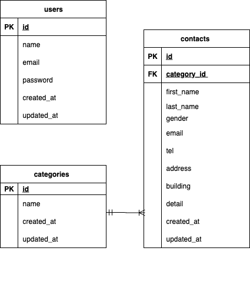

# お問い合わせフォーム

## 概要

ユーザーがフォームから問い合わせを送信し、管理者画面から確認・削除・CSV 出力が行えます。

## 環境構築

### Docker ビルド

1. git clone https://github.com/hikaru-jp/-laravel-contact-form.git
2. docker-compose up -d --build

※ MySQL は、OS によって起動しない場合があるので、それぞれの PC に合わせて docker-compose.yml ファイルを編集してください。

### Laravel 環境構築

1. docker-compose exec php bash
2. composer install
3. .env.example ファイルから.env を作成し、環境変数を変更
4. php artisan key:generate
5. php artisan migrate
6. php artisan db:seed

## 使用技術

- PHP 8.1
- Laravel 8.83
- MySQL 8.x

## ER 図

本アプリケーションの ER 図は以下の通りです。

## URL

- お問い合わせ画面 : [http://localhost/](http://localhost/)
- 管理画面 : [http://localhost/admin](http://localhost/admin)  
  ※ 管理画面はログイン必須になります。最初にログイン画面が表示されます。

## 注意事項

- `categories` テーブルのカラム名は`name` を使用しています。
- Seeder / CSV 出力など既存コードが `name` 前提により。
